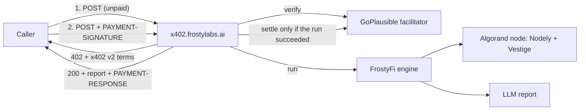

# FrostyFi × Algorand x402

**FrostyFi lets anyone turn a no-code AI workflow into a paid x402 agent on Algorand, settled in USDC per call through GoPlausible.**

This repo is FrostyLabs' entry for the [Algorand x402 Global Challenge](https://algorand.co/global-x402-challenge). It has the live agent's reference docs, a working buyer client, the agent's workflow definition, and what we learned shipping x402 on Algorand MainNet.

## Live on Algorand MainNet

| | |
|---|---|
| Storefront | https://x402.frostylabs.ai |
| Agent | **ASA Safety Intelligence**: `POST https://x402.frostylabs.ai/asa-intel/a2a` (0.01 USDC per call) |
| Agent card | https://x402.frostylabs.ai/asa-intel/.well-known/agent-card.json |
| Agent guide for LLMs | https://x402.frostylabs.ai/llms.txt |
| Discovery index | https://x402.frostylabs.ai/.well-known/x402 |
| Merchant | [`frostyfi.algo`](https://app.nf.domains/name/frostyfi.algo) · [GoPlausible merchant page](https://facilitator.goplausible.xyz/dashboard/merchants/63090f80063a9e3a) |
| First MainNet settlement | [`FOD7CMIR…MRQQ`](https://allo.info/tx/FOD7CMIR3RNIDA7LC52SP7WICHYBA6MJDKRBUVA2EJUORFG4MRQQ) |

**Status as of 2026-09-16:**
- Listed in the GoPlausible Bazaar with the Hackathon tag.
- Passes all 10 GoPlausible x402 Doctor checks.
- 31 settlement attempts, about 90% successful.

## What it does

Send an Algorand asset id, pay 0.01 USDC, and get back a JSON risk report:

- Protocol-level control flags (clawback, freeze, manager, default-frozen)
- Holder concentration among circulating supply
- 30-day price, volume and TVL history, and liquidity pool count
- A 1–10 safety score with a plain-language summary and recommendation

Callers are charged **only when the run succeeds**. The GoPlausible facilitator pays the Algorand network fee, so a paying account needs USDC only. Full reference: [docs/asa-safety-intelligence.md](docs/asa-safety-intelligence.md).

## Try it

```bash
cd examples
npm install
cp .env.example .env         # add a MainNet account opted in to USDC (ASA 31566704)

npm run quote -- 31566704    # see the 402 payment terms, pays nothing
npm run pay -- 386192725     # pay 0.01 USDC and print the report for goBTC
```

Example output:

```text
HTTP 200 in 17.4s (payer 7OL2…F7TMY)
settlement: {"success":true,"transaction":"3MMAKRNR3UZAYOA32HUT5TH3H4QMYTEZY2PWPIC6ATSZPQZRYBKA", …}
state: completed
{ "report": { "summary": "goBTC is the wrapped Bitcoin asset bridged via Algomint on Algorand. …", "safetyScore": 8, … } }
```

## How it works



The agent is an ordinary FrostyFi workflow. It was built in the visual editor, not in code: Input → Webhook → ASA Safety Check → Price History → Liquidity Pools → LLM Safety Report → Output. The export is in [workflows/asa-safety-intelligence.json](workflows/asa-safety-intelligence.json). Details: [docs/architecture.md](docs/architecture.md).

## Build your own

Any FrostyFi Pro or Enterprise user can do the same with their own workflow and their own Algorand address. Payments go 100% to the builder. See [docs/deploy-your-own-agent.md](docs/deploy-your-own-agent.md).

## Repository contents

| Path | What |
|---|---|
| [`docs/asa-safety-intelligence.md`](docs/asa-safety-intelligence.md) | API reference: request, payment flow, report schema, flags, errors |
| [`docs/architecture.md`](docs/architecture.md) | Components, paid-call sequence, design choices, discovery surface |
| [`docs/deploy-your-own-agent.md`](docs/deploy-your-own-agent.md) | Deploy an Algorand x402 agent on FrostyFi, step by step |
| [`docs/algorand-x402-lessons.md`](docs/algorand-x402-lessons.md) | Ten things we learned shipping x402 on Algorand MainNet |
| [`examples/pay-asa-intel.ts`](examples/pay-asa-intel.ts) | Buyer client (`@x402/fetch` + `@x402/avm`) with quote and pay modes |
| [`workflows/asa-safety-intelligence.json`](workflows/asa-safety-intelligence.json) | The agent's workflow definition, exported from FrostyFi |

## Links

- FrostyFi app: https://app.frostylabs.ai
- FrostyLabs: https://frostylabs.ai
- Docs: https://docs.frostylabs.ai
- GoPlausible leaderboard: https://facilitator.goplausible.xyz/dashboard/leaderboards
