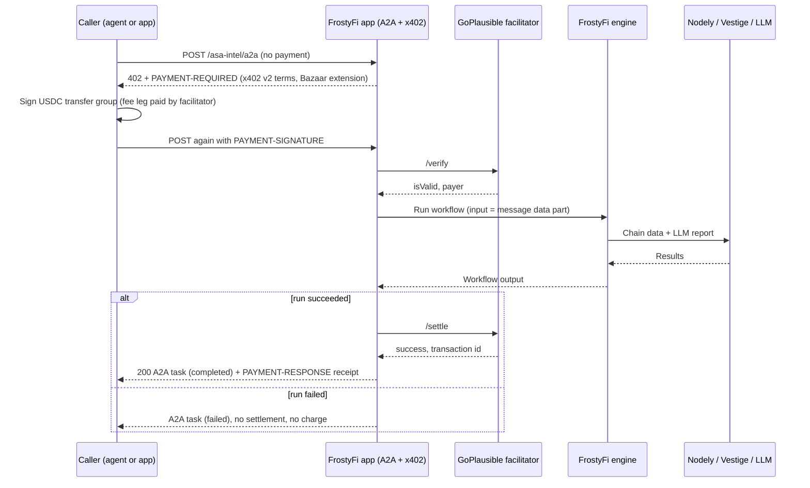

# Architecture

FrostyFi turns a visual workflow into a paid x402 agent. This page covers how that works on Algorand.

## Components

| Component | Role |
|---|---|
| **FrostyFi app** (app.frostylabs.ai) | Visual workflow builder. Also hosts each agent's A2A endpoint, x402 payment gate, agent card and discovery files. |
| **FrostyFi engine** | Runs deployed workflows node by node on webhook, schedule or paid call. |
| **Algorand node** | Workflow node for live chain data: [Nodely](https://nodely.io) algod and indexer (accounts, assets, holders, transactions) plus the [Vestige](https://vestigelabs.org) API (prices, history, pools, wallet value and PnL, ASA safety check). |
| **LLM node** | Turns the collected data into a report (OpenRouter models). |
| **GoPlausible facilitator** | Verifies and settles the x402 payment on Algorand MainNet, pays the network fee, and catalogs the endpoint in its Bazaar. |

## Paid call

### Design choices

- **Charged only on success.** Settlement runs after the workflow finishes, on every chain FrostyFi supports. A failed run never moves funds, and if settlement fails the result is withheld.
- **Replay lock.** A signed Algorand payment group is locked (keyed by a hash of the group) while it is being processed, so it can't be reused for a second run.
- **402-first.** Any unpaid request gets the payment challenge before the body is validated, including body-less, non-JSON and non-JSON-RPC probes. Indexers and GoPlausible's x402 Doctor probe exactly this way.
- **One merchant, one domain.** All FrostyFi challenge agents share one payTo (`frostyfi.algo`) and one root domain, `x402.frostylabs.ai`, with each agent on its own path (a Composite entry). Other FrostyFi agents keep their own `agent-<slug>.frostylabs.ai` host.

## Discovery surface

| URL | Purpose |
|---|---|
| `https://x402.frostylabs.ai/` | Storefront page. Its OpenGraph metadata feeds GoPlausible's merchant page. |
| `/.well-known/x402` | x402 discovery index of this domain's paid endpoints only |
| `/.well-known/agent-card.json`, `/.well-known/agent.json` | Directory card listing each agent's endpoint, card, price and example request |
| `/llms.txt`, `/agents.md` | Plain-text guide for agents: how to call and pay, plus each agent's example body |
| `/<slug>/.well-known/agent-card.json` | Per-agent A2A card with input schema and examples |
| `/<slug>/a2a` | Paid A2A endpoint |

Every 402 includes the Bazaar discovery extension (`extensions.bazaar`). GoPlausible validates `info` against `schema` and lists the endpoint in its Bazaar after the first settled payment. The extension's example body comes from the workflow's Input node: its fields and their defaults.

## Latency

Paid calls on 2026-09-16 took 11.6–25.1 s end to end, measured from the client. Most of that is the LLM step (about 6–11 s) and the facilitator's settlement (about 5 s). The holder-concentration indexer query takes about 5 s on assets with very large holder sets (USDC, USDt), so the engine caches that result per asset for 10 minutes.
